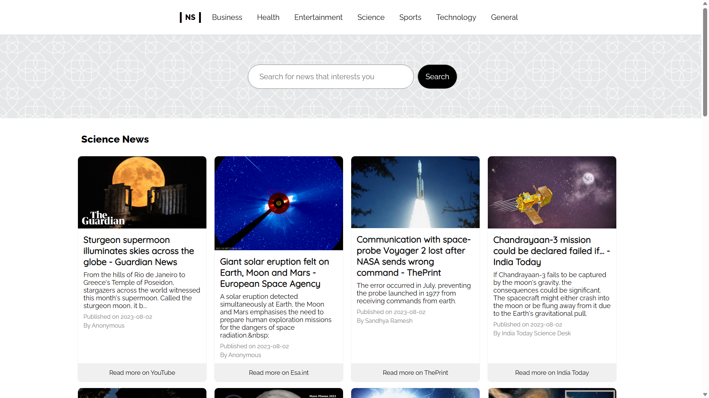
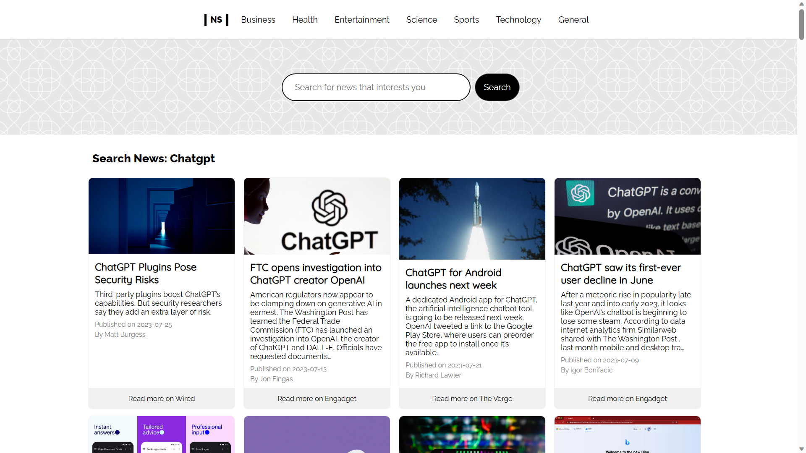
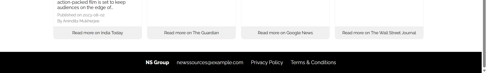

# News Sources App

News Sources is a comprehensive web application that aims to simplify the process of finding news online.

With the multitude of news sources available, it can be exhausting and time-consuming to browse through different websites to get the latest updates on various topics.

This app addresses that challenge by aggregating news sources from different categories, providing users with a one-stop platform to access a wide range of news content.

The app allows a user to:
- View news article headlines.
- See the author/source of a news article.
- View different news categories and get articles for a selected category.
- Search for different news articles.
- Read full news article by clicking on the linked article.
- Get our contacts for more enquiry.

# Setup Requirements
- Visual Studio Code, see [here](https://code.visualstudio.com/)
- Windows Subsystem for Linux (WSL), details [here](https://learn.microsoft.com/en-us/windows/wsl/install)
- Git
- Github and GitHub pages [deployment](https://eugenemrg.github.io/News-Sources/)
- Node.js (includes npm), see [here](https://nodejs.org/en)
- json-server, see [here](https://www.npmjs.com/package/json-server)
- Any Modern Web Browser

# Installation
To run the News App locally:

- Clone/Download the repository.
- Install the required dependencies using `npm install.`
- Start the development server using `npm start.`
- Open your browser and navigate to `http://localhost:3000` or to the link with any other available port assigned when starting the server
- The app should run on any modern web browser with JavaScript enabled

# Issues
- A known issue is that the deployed website will not display articles, this is because we use the free NewsAPI plan that can only show results when working on localhost / development.

# Dependencies
The News App project uses the following dependencies:

- React - A JavaScript library for building user interfaces.
- gh-pages - Deploys React application to GitHub pages
- React Router - Routes links to give React a multi-page experience

# Languages and APIs
- HTML and CSS
- JavaScript
- React / JSX
- JSON
- NewsAPI - An API to fetch news articles, see [here](https://newsapi.org/)

# Screenshots
View news article headlines, see authors/source(s) and view articles from a selected category.

Search for different news articles.

Get our contacts for more enquiry.

# Contributing
Contributions are welcome! If you find any bugs or want to add new features, feel free to open an issue or submit a pull request. Please follow the existing code style and conventions.

# Author(s)
This is a group project created by:

- [Eugene Aduogo](https://github.com/eugenemrg/)
- [Catherine Mathenge](https://github.com/CatherineMathenge)
- [Erick Aboge](https://github.com/Abogeerick)
- [Levina Njambi](https://github.com/levina23)
- [Titus Munyoki](https://github.com/mwaniki-Titus)

# License
News Sources. An app that provides the most convenient way to access all news stories in one place

Copyright (C) 2023

Licensed under GNUv3. See [license](/LICENSE)

This program is free software: you can redistribute it and/or modify
it under the terms of the GNU General Public License as published by
the Free Software Foundation, either version 3 of the License, or
(at your option) any later version.

This program is distributed in the hope that it will be useful,
but WITHOUT ANY WARRANTY; without even the implied warranty of
MERCHANTABILITY or FITNESS FOR A PARTICULAR PURPOSE.  See the
GNU General Public License for more details.

You should have received a copy of the GNU General Public License
along with this program.  If not, see <https://www.gnu.org/licenses/>.

# Acknowledgements
The News App project is created for learning purposes and uses the newsapi.org to fetch news articles.